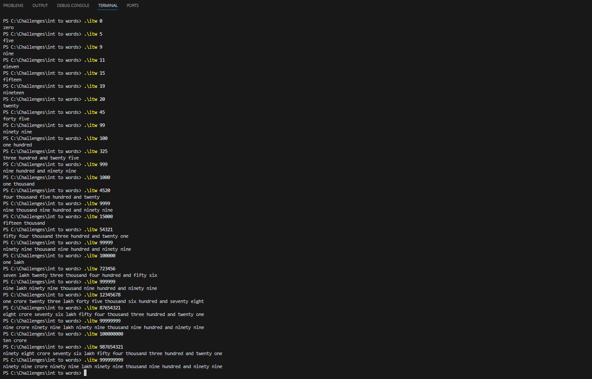

# Integer to Words Converter (Indian Number System) 🧮

## Overview

This C++ command-line application converts integers into their word representation based on the Indian numbering system. It accepts integers as input and prints the corresponding number in words, making it especially useful for applications like cheques, bills, and reports that require textual representation of numbers.

### Example:

```bash
./itw 52345
```

**Output**: `Fifty-Two Thousand Three Hundred Forty-Five`

---

## Features

- Supports **Indian Number System** (lakhs, crores, etc.).
<!-- Handles integers from 0 up to 99,99,99,999.-->
- Efficiently breaks down numbers into logical units (units, tens, hundreds, thousands).
- Modular code structure with clear separation of logic, functions, and prototypes.

---

## Directory Structure

```
|-- itw.cpp         # Main logic of the program
|-- functions.cpp   # Functions for converting digits into words
|-- itw.h           # Header file with function prototypes
|-- README.md       # Project documentation (this file)
|-- LICENSE         # License information
```

---

## Usage

### Command-line Interface (CLI)

The program accepts integers as arguments and displays the corresponding number in words. Run the executable as follows:

```bash
./itw <integer>
```

### Example Commands:

```bash
./itw 4586
```

**Output**: `Four Thousand Five Hundred Eighty-Six`

```bash
./itw 123456
```

**Output**: `One Lakh Twenty-Three Thousand Four Hundred Fifty-Six`

---

## How It Works

### Logic for Number Conversion:

1. **Numbers 0-19**: These are hardcoded in an array for quick access (e.g., `0 = ""`, `1 = "One"`, ... `19 = "Nineteen"`).
2. **Tens (20-99)**: Numbers like "Twenty", "Thirty" are stored, and digits are appended (e.g., `34 = "Thirty-Four"`).
3. **Thousands and Lakhs**: The application breaks the number into thousands, lakhs, crores, and converts each part into words.
4. **Optimized Handling**: For numbers between 10,000 and 99,999, two digits are passed into the `thousands` variable, simplifying the conversion logic.

### Modularity:

- **Main Logic** (`itw.cpp`): Controls the flow and handles input/output.
- **Functions** (`functions.cpp`): Contains specific functions for each number range, making the code more readable and reusable.
- **Header** (`itw.h`): Includes all function prototypes and constants for easy reference across the project.

---

## Build Instructions

### Prerequisites

- C++ compiler (g++ recommended)
- Command-line environment (Linux, MacOS, or Windows)

### Compiling the Project

To compile the program, use the following command:

```bash
g++ itw.cpp functions.cpp -o itw
```

### Running the Program

Once compiled, run the program as follows:

```bash
./itw <integer>
```

Example:

```bash
./itw 98304
```

---

## Future Enhancements

- [ ] **Decimal Handling**: Add functionality to convert decimal numbers into words.
- [ ] **Localization**: Extend support for other number systems or languages.
- [ ] **Error Handling**: Improve input validation for non-integer inputs.

---

## License

This project is licensed under the MIT License. See the [LICENSE](./LICENSE) file for more details.

---

## Contributing

Contributions, issues, and feature requests are welcome! Feel free to check the [issues page](https://github.com/AadhilKassim/itw/issues) or submit a pull request.

---

## Author

👤 **Aadhil Kassim**

- GitHub: [@AadhilKassim](https://github.com/AadhilKassim)
- LinkedIn: [Aadhil Kassim](www.linkedin.com/in/aadhilkassim)

---

## Acknowledgements

Special thanks to [Daniel Gakwaya](https://www.github.com/rutura) and the FreeCodeCamp community for inspiring the C++ journey.

---

## Show Your Support

If you like this project, give it a ⭐️ on GitHub!

---

## Screenshots


